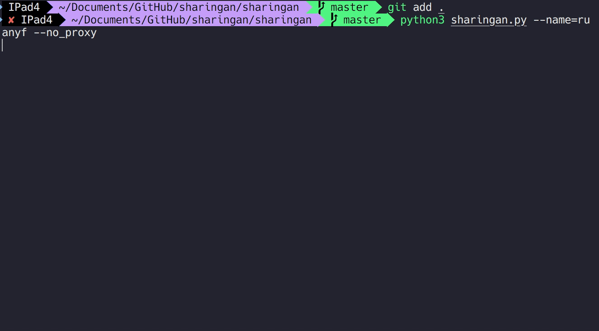

<p align="center">

    <h1 align="center" >Sharingan</h1>
    <p align="center"> We will try to find your visible basic footprint from social media as much as possible</p>
        <p align="center">
    <a href="https://app.codacy.com/manual/aoii103/Sharingan?utm_source=github.com&utm_medium=referral&utm_content=aoii103/Sharingan&utm_campaign=Badge_Grade_Dashboard"></a>
    <a target="_blank" href="https://www.python.org/downloads/" title="Python version"></a>
    <a target="_blank" href="LICENSE" title="License: MIT"></a>
</p>

> 中文版: [Readme_cn](README_cn.md)

# Environmental

First, ensure that you have installed the `python3.8+` , and then run the following commands.

```bash
git clone https://github.com/aoii103/Sharingan.git

cd sharingan

python3 setup.py install
```

or via pip

```bash
pip install sharingan
```

# Usage

```sh
python3 -m sharingan blue

```



# Add New Targets

I have considered using `JSON` as the site's configuration file, but later wrote it in `extract.py`

And what we need to do is add the following method under class `Extractor`, where the `def upload` method stores the basic configuration of the corresponding site

For optional configurations, see [`models.py`](https://github.com/aoii103/Sharingan/blob/master/sharingan/models.py#L25)

```python

    @staticmethod
    def __example() -> Generator:
        """
            1. <-- yield your config first
            2. --> then got your datas back
            3. <-- finally, yield the extracted data back
        """
        T = yield from upload(
            **{
                "url": "http://xxxx",
            }
        )

        T.name = T.html.pq('title').text()
        ...

        yield T

```

# Singel Test

Sometimes we need to test for a new site

And we can use the following code . for example, when the target is `twitter`

```bash

python3 -m sharingan larry --singel=twitter
```

# Create sites from sherlock

run the following command first

```bash
python3 -m sharingan.common
```

and it will create a python file named `templates.py`

```python
    @staticmethod
    def site_2Dimensions():
        T = yield from upload(url='''https://2Dimensions.com/a/{}''',)

        T.title = T.html.pq('title').text()
        yield T

    @staticmethod
    def site_3dnews():
        T = yield from upload(url='''http://forum.3dnews.ru/member.php?username={}''',error_type='text',error_msg='''Пользователь не зарегистрирован и не имеет профиля для просмотра.''',)

        T.title = T.html.pq('title').text()
        yield T

    ...
```

then replace them into `extract.py`

# Options

```

Usage: __main__.py [OPTIONS] NAME

Options:
  --name TEXT        The username you need to search
  --proxy_uri TEXT   Proxy address in case of need to use a proxy to be used
  --no_proxy         All connections will be directly connected
  --save_path TEXT   The storage location of the collected results
  --pass_history     The file name will be named according to the scan endtime
  --singel TEXT      Commonly used for single target information acquisition or testing
  --debug            Debug model
  --update           Do not overwrite the original data results
  --workers INTEGER  Number of concurrent workers
  --help             Show this message and exit.

```

# TODO

- Formatted output

# 📝 License

This project is [MIT](https://github.com/kefranabg/readme-md-generator/blob/master/LICENSE) licensed.

---

If you think this script is useful to you, don't forget star 🐶. Inspired by ❤️ [sherlock](https://github.com/sherlock-project/sherlock)
